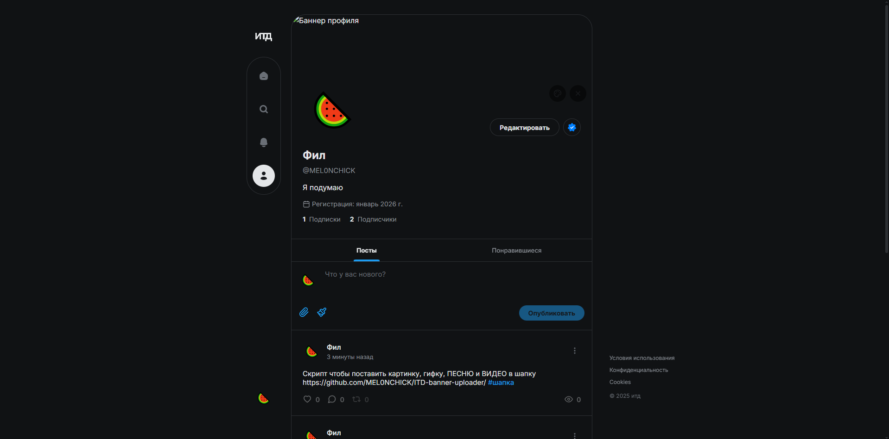
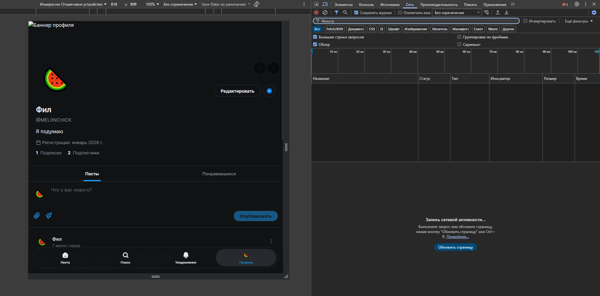
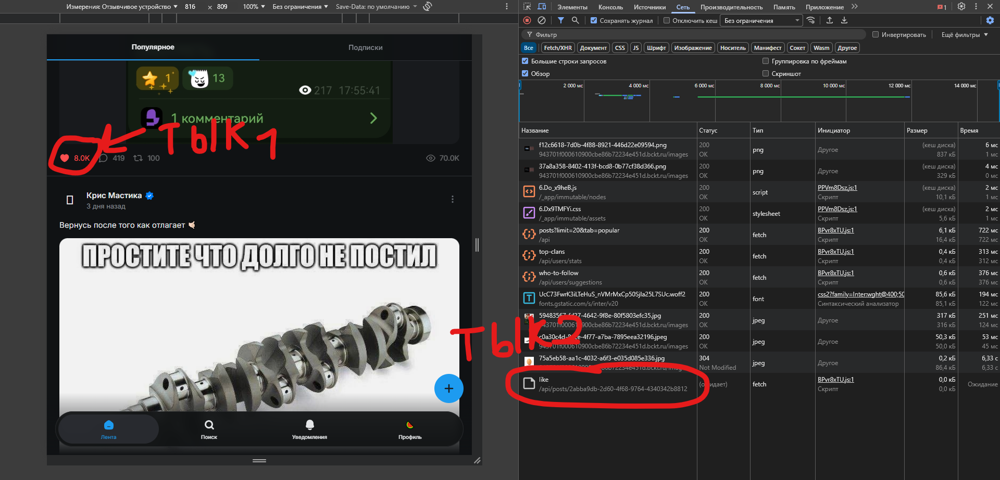
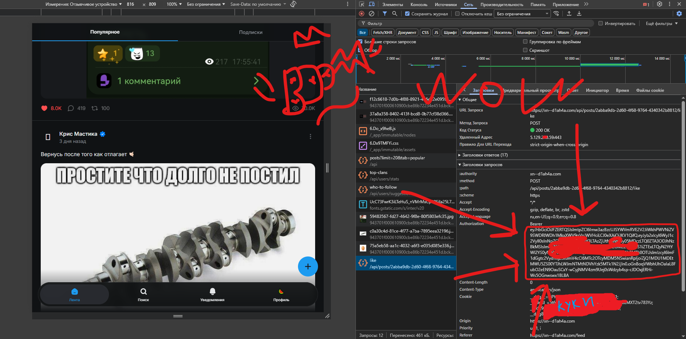

# ITD-banner-uploader
Интерактивный крипт который поможет загрузить свое фото в шапку профиля в социальной сети от блогера nowkie - ИТД

Поместите картинки, музыку, гифки или видео вы папку files рядом с app.py и upload.py (если таковай папки нет то создайте её)

# Но просмотр музыки и видео работает иначе, вот как их посммотреть: 

## Шаг 1

Не удивляемся

## Шаг 2 

Кпируем ссылку

## Шаг 3

Преходим по сслыке

---
bearer - это код который позволяет нам войти в аккаунт в обход авторизации и этот код в нашем случае рабоотает минут 15-20 и если что его можно взять заново

Но как-же получить который нужно вставить в файл?
## Шаг 1

Заходим на сайт

## Шаг 2

Нажимаем на клавишу F12
Заходим на сайт

## Шаг 3

Лайкаем пост и баузер фиксиует запрос, на него и тыкаем

## Шаг 4

Копируем код, он у всех такой длинный

